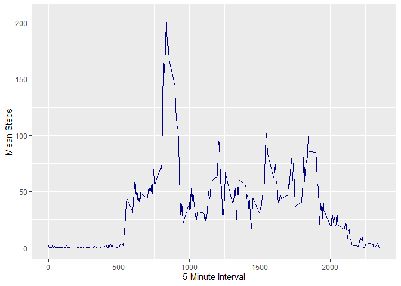

## Introduction

Hi! My name is Carlos Chunga and this is my first peer-graded assignment for the "Reproducible Research" course on Coursera by Johns Hopkins University. This may be a very long R Markdown Document (or HTML, if you're reading the final output), but I really enjoyed writing and coding for this assignment. I tried to be as succinct and clear as possible in each section to make your evaluation easier.

If you're reading the R Markdown document instead of the HTML file, bear in mind that I didn't need to specify `echo = TRUE` in each code chunk. I specified it in the "r setup" code chunk, as a default option for the entire R Markdown.

Hope you read the document and are learning as much as me from this amazing course!

## Loading and preprocessing the data

*Show any code that is needed to*

**1. Load the data (i.e. read.csv)**

Here it is important to note that I used `read_csv()` from the readr package (contained in the tidyverse) instead of `read.csv()` from base R. In the "R for Data Science" book from Hadley Wickham, the creator of the tidyverse (dplyr, ggplot2, readr, etc.), he, alongside Garrett Grolemund, mention 3 reasons why functions like `read_csv()` from the readr package are preferable to other functions like `read.csv()` from base R:

> They are typically much faster (~10x) than their base equivalents. Long running jobs have a progress bar, so you can see what’s happening. If you’re looking for raw speed, try data.table::fread(). It doesn’t fit quite so well into the tidyverse, but it can be quite a bit faster.

> They produce tibbles, they don’t convert character vectors to factors, use row names, or munge the column names. These are common sources of frustration with the base R functions.

> They are more reproducible. Base R functions inherit some behaviour from your operating system and environment variables, so import code that works on your computer might not work on someone else’s.

Given the present course we're all taking, I think the last of these reasons is the most important.

Bear in mind that tibbles are an attractive alternative to plain data frames: they are much easier to work with. But, at their core, they're essentially data frames with added features.

You can read these lines in their online book here: [Chapter 11: Data Import](https://r4ds.had.co.nz/data-import.html)


```r
library(tidyverse)
activity <- read_csv("activity.csv")
```

**2. Process/transform the data (if necessary) into a format suitable for your analysis**

This will be done later on depending on the required transformation to obtain the desired output. For now, it won't be necessary to make any other transformation to the "activity" data frame.

## What is mean total number of steps taken per day?

*For this part of the assignment, you can ignore the missing values in the dataset.*

**1. Calculate the total number of steps taken per day**

Here I show you the first rows of this newly created data frame. Adding `%>% print(n = dim(activity)[1])` at the end of the following code will show all the 61 rows corresponding to all days from October and November 2012 alongside their total steps in each day.


```r
activity %>% 
  group_by(date) %>% 
  summarize(total_steps = sum(steps, na.rm = TRUE))
```

```
## # A tibble: 61 x 2
##    date       total_steps
##    <date>           <dbl>
##  1 2012-10-01           0
##  2 2012-10-02         126
##  3 2012-10-03       11352
##  4 2012-10-04       12116
##  5 2012-10-05       13294
##  6 2012-10-06       15420
##  7 2012-10-07       11015
##  8 2012-10-08           0
##  9 2012-10-09       12811
## 10 2012-10-10        9900
## # ... with 51 more rows
```

**2. If you do not understand the difference between a histogram and a barplot, research the difference between them. Make a histogram of the total number of steps taken each day**

In a nutshell, a histogram shows the distribution of values of a continuous variable; the Y-axis can represent the frequency of each interval or the density. On the other hand, a bar plot shows categorical variables in the X-axis and their corresponding values for another variable in the Y-axis.


```r
activity %>% 
  group_by(date) %>% 
  summarize(total_steps = sum(steps, na.rm = TRUE)) %>% 
  ggplot(aes(total_steps)) +
  geom_histogram(binwidth = 1750, fill = "rosybrown") +
  scale_x_continuous(breaks = seq(0, 21194, 2500)) +
  labs(x = "Total Number of Steps", y = "Number of Days")
```

<!-- -->

Due to the functioning of dplyr, we get several days with 0 total number of steps, thus constituting a bias. In fact, most of these days (8 out of 10) correspond to days with missing values as we will see later in the 4th question of the "Imputing missing values" section. There, I show an almost identical green histogram, but only with 2 days with 0 total number of steps.

**3. Calculate and report the mean and median of the total number of steps taken per day**


```r
temp_activity <- activity %>% 
  group_by(date) %>% 
  summarize(total_steps = sum(steps, na.rm = TRUE))

mean(temp_activity$total_steps, na.rm = TRUE)
```

```
## [1] 9354.23
```

```r
median(temp_activity$total_steps, na.rm = TRUE)
```

```
## [1] 10395
```

We get a mean of **9354.23 steps** and a median of **10395 steps**.

## What is the average daily activity pattern?

**1. Make a time series plot (i.e. type = "l") of the 5-minute interval (x-axis) and the average number of steps taken, averaged across all days (y-axis)**

Instead of using `plot()` with `type = "l"` as an argument, I used `geom_line()` from ggplot2. According to our instructor, Roger Peng:

> For the plotting aspects of this assignment, feel free to use any plotting system in R (i.e., base, lattice, ggplot2)  

Here I show you the time series plot. It is important to highlight that we have several NaN (Not a Number) missing values. Specifically, we have 8 NaNs in the following dates: 2012-10-01, 2012-10-08, 2012-11-01, 2012-11-04, 2012-11-09, 2012-11-10, 2012-11-14, and 2012-11-30.


```r
activity %>% 
  group_by(interval) %>% 
  summarize(mean_steps = mean(steps, na.rm = TRUE)) %>% 
  ggplot(aes(interval, mean_steps)) +
  geom_line(color = "navyblue") +
  labs(x = "5-Minute Interval", y = "Mean Steps")
```

<!-- -->

**2. Which 5-minute interval, on average across all the days in the dataset, contains the maximum number of steps?**


```r
activity %>% 
  group_by(interval) %>% 
  summarize(mean_steps = mean(steps, na.rm = TRUE)) %>% 
  mutate(rank = rank(-mean_steps)) %>% 
  filter(rank == 1)
```

```
## # A tibble: 1 x 3
##   interval mean_steps  rank
##      <dbl>      <dbl> <dbl>
## 1      835       206.     1
```

According to this transformation, the 5-minute interval that, on average across all days, contains the maximum number of steps, is the **835 interval** with an average of **206 steps**.

## Imputing missing values

*Note that there are a number of days/intervals where there are missing values (coded as NA). The presence of missing days may introduce bias into some calculations or summaries of the data.*

**1. Calculate and report the total number of missing values in the dataset (i.e. the total number of rows with NAs)**

We only have missing values in the "steps" column:


```r
sum(is.na(activity$steps))
```

```
## [1] 2304
```

The total number of missing values in the dataset is **2304**.

**2. Devise a strategy for filling in all of the missing values in the dataset. The strategy does not need to be sophisticated. For example, you could use the mean/median for that day, or the mean for that 5-minute interval, etc.**

I decided to take the mean of each 5-minute interval in a new data frame ("means"), which is then used to create another data frame ("input_means") with the appropriate length (equal to the number of missing values in the steps column of our original data frame) and "means" corresponding to each interval. Finally, "input_means" is used to substitute the missing values.

**3. Create a new dataset that is equal to the original dataset but with the missing data filled in.**


```r
means <- activity %>% 
    group_by(interval) %>% 
    summarize(mean_steps = mean(steps, na.rm = TRUE))

activity2 <- activity
input_means <- left_join(activity2[is.na(activity2$steps), 3], means)
activity2[is.na(activity2$steps), 1] <- input_means$mean_steps

head(activity2)
```

```
## # A tibble: 6 x 3
##    steps date       interval
##    <dbl> <date>        <dbl>
## 1 1.72   2012-10-01        0
## 2 0.340  2012-10-01        5
## 3 0.132  2012-10-01       10
## 4 0.151  2012-10-01       15
## 5 0.0755 2012-10-01       20
## 6 2.09   2012-10-01       25
```

This new data frame without missing values is called "activity2".

**4. Make a histogram of the total number of steps taken each day and Calculate and report the mean and median total number of steps taken per day. Do these values differ from the estimates from the first part of the assignment? What is the impact of imputing missing data on the estimates of the total daily number of steps?**


```r
activity2 %>% 
  group_by(date) %>% 
  summarize(total_steps = sum(steps, na.rm = TRUE)) %>% 
  ggplot(aes(total_steps)) +
  geom_histogram(binwidth = 1750, fill = "springgreen3") +
  scale_x_continuous(breaks = seq(0, 21194, 2500)) +
  labs(x = "Total Number of Steps", y = "Number of Days")
```

<!-- -->

If you compare this histogram to the previous one, which includes the missing values, you may conclude that they are practically identical, **with the exception of those 8 days with missing values coded as zeros**. Those 8 days are now distributed across other histogram bins.

Now, we proceed to calculate the mean and median total number of steps taken per day in this new data set:


```r
temp_activity2 <- activity2 %>% 
  group_by(date) %>% 
  summarize(total_steps = sum(steps, na.rm = TRUE))

mean(temp_activity2$total_steps, na.rm = TRUE)
```

```
## [1] 10766.19
```

```r
median(temp_activity2$total_steps, na.rm = TRUE)
```

```
## [1] 10766.19
```

We see that our original data set yielded a mean of **9354.23 steps** and a median of **10395 steps**. Compared with our new data set with the missing data filled in, this one yields a mean of **10766.19 steps** and a median of **10766.19 steps** too.

Since out new mean is bigger and also coincides with the new median, we have a perfectly symmetrical distribution (this is the impact of imputing missing data on the estimates of the total daily number of steps). In the original data set we had mean of steps < median of steps, which indicated a bias in our data; particularly, a negative skew.

## Are there differences in activity patterns between weekdays and weekends?

*For this part the weekdays() function may be of some help here. Use the dataset with the filled-in missing values for this part.*

**1. Create a new factor variable in the dataset with two levels – “weekday” and “weekend” indicating whether a given date is a weekday or weekend day.**

Here I create this new factor variable called "week_type". Before doing that, I create another factor variable called "weekday" indicating if the date corresponds to Monday, Tuesday, Wednesday, etc. I call `Sys.setlocale("LC_TIME", "English")` to make sure that whoever runs this code gets the name of the days of the week in English.


```r
Sys.setlocale("LC_TIME", "English")
```

```
## [1] "English_United States.1252"
```

```r
activity3 <- activity2
activity3$weekday <- factor(weekdays(activity$date), 
                            levels = c("Sunday", "Monday", "Tuesday", "Wednesday", "Thursday", "Friday", "Saturday"))
activity3$week_type <- ifelse(activity3$weekday %in% c("Monday", "Tuesday", "Wednesday", "Thursday", "Friday"),
                              "Weekday",
                              "Weekend")
activity3$week_type <- as_factor(activity3$week_type)
```

**2. Make a panel plot containing a time series plot (i.e. type = "l") of the 5-minute interval (x-axis) and the average number of steps taken, averaged across all weekday days or weekend days (y-axis). See the README file in the GitHub repository to see an example of what this plot should look like using simulated data.**

In the README file, Professor Peng uses the lattice package as an example. Once again, here I use ggplot2 just because it's easier to use, more elegant, and more popular than lattice or base.


```r
activity3 %>% 
  group_by(week_type, interval) %>% 
  summarize(mean_steps = mean(steps, na.rm = TRUE)) %>% 
  ggplot(aes(interval, mean_steps)) +
  geom_line(color = "salmon3") +
  facet_grid(week_type ~ .) +
  labs(x = "5-Minute Interval", y = "Mean Steps")
```

<!-- -->

Overall, we see less average steps before the 1000 interval for the weekends, and more activity patterns between the 1000 and 1750 intervals for the weekends as well.

## Conclusion

This document answered each of the questions posed for the first peer-graded assignment. I made extensive use of ggplot2 and other packages from the popular tidyverse: dplyr, readr, among others.

Looking forward to reading your feedback!

Kind regards,  
Carlos Chunga.
